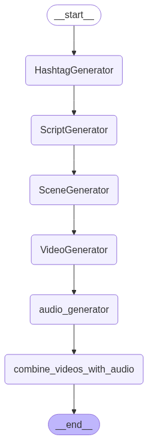

# Viral Video Generator

**Langgraph Application Workflow**



**Sample Input**
```Enter the description for the viral video: Make a long video for a client to promote his website design services.```

**Sample Output**

[🎥 Generated Video](final_video_with_audio.mp4)

[Watch on YouTube](https://youtube.com/shorts/DaIMJY1yVGE?feature=share)

## Overview

This project automates the entire workflow of generating viral videos by combining cutting-edge AI technologies:

- **Video Generation:** Uses the **Sora** video generation model from **Azure OpenAI**  
- **Text-to-Speech:** Utilizes **Eleven Labs** for realistic and natural speech synthesis  
- **Natural Language Generation:** Powered by **Google's Gemini** to create engaging and relevant content  
- **Workflow Orchestration:** Managed using the open-source framework **LangGraph** for seamless integration  
- **Video Editing:** Final video assembly and editing performed with **MoviePy**


## Features

- End-to-end automated viral video creation pipeline  
- Integration of best-in-class AI models for content, voice, and video  
- Modular and extensible architecture for easy customization  
- Open source orchestration framework for workflow control  
- High-quality video editing with Python-based MoviePy library


## How It Works

1. **Content Generation:** Google's Gemini model generates the script or text content for the video.  
2. **Voice Synthesis:** The generated text is converted into lifelike speech using Eleven Labs TTS API.  
3. **Video Creation:** The Sora model from Azure OpenAI produces video clips based on the script and audio.  
4. **Editing:** MoviePy stitches video and audio, applies edits, and produces the final viral-ready video.  
5. **Workflow Management:** LangGraph orchestrates the entire process, ensuring smooth data flow between components.


## Getting Started

### Prerequisites

- Azure OpenAI account with access to the Sora video generation model  
- Eleven Labs API key for text-to-speech  
- Access to Google's Gemini API for natural language generation  
- Python 3.x environment  

### Installation

```bash
git clone https://github.com/nishalahmedpk/viral-video-generator.git
cd viral-video-generator
pip install uv
uv run main.py
```

## Configuration
Add your API keys and any necessary settings to a .env file or your configuration file. Example .env:

```
AZURE_OPENAI_API_KEY=your_azure_openai_key_here
AZURE_OPENAI_DEPLOYMENT_NAME=sora
AZURE_OPENAI_ENDPOINT=endpoint
ELEVENLABS_API_KEY=your_elevenlabs_key_here
GOOGLE_GEMINI_API_KEY=your_google_gemini_key_here
```

## Future Improvements

Dynamic Prompt Synthesis: Enhance content relevance by dynamically generating and refining prompts

Advanced Tooling Integration: Incorporate additional AI tools and models for improved video creativity and quality

Interactive UI: Develop a user-friendly interface to customize video parameters and monitor generation progress

Scalability: Optimize for batch video generation and cloud deployment

